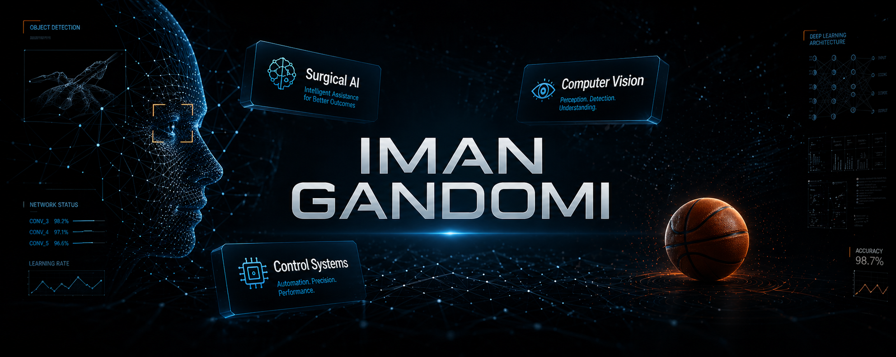

<!-- ۱. تصویر بنر جدید و ساده -->

  

 

<!-- ۲. آمار زنده پروفایل (همان کدهای قبلی با یوزرنیم شما) -->

  

<!-- ۳. لینک‌های ارتباطی و رزومه (همان کدهای قبلی) -->

 

---

<!-- بخش بیوگرافی که قبلاً داشتیم -->
## 🚀 What I'm Working On
---

| Description 🧠 | Focus Area 🎯 |
| :--- | :--- |
| Developing temporally consistent segmentation and tracking frameworks for cataract surgery videos | **Surgical Video Understanding** 🩺 |
| Automated quantification of surgical proficiency via kinematic analysis and instrument interaction tracking | **AI-Driven Skill Assessment** 📊 |
| Engineering RAG-based agents to generate actionable feedback and interpretable medical narratives | **LLM & RAG for Medicine** 🤖 |
| Integrating vision-based control and deep learning for real-time surgical assistance and morphological analysis | **Computer Vision & Control** 👁️ |
| Spearheading cross-disciplinary R&D teams and mentoring research groups at ARAS AI Lab and Medivers Ai | **Technical Leadership** 🏫 |
